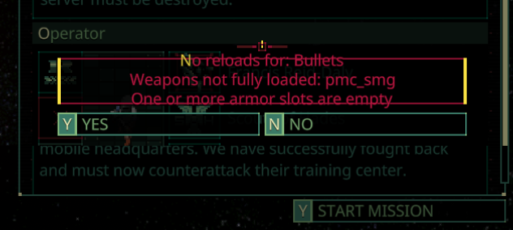

# Quasimorph Extra Deployment Checks

Just deployed on a mission to find that the merc wasn't reloaded from the previous mission's "unload all"? 

This mod includes optional loadout checks to the deployment window.

When deploying, the confirmation window will be shown if any of the optional checks below fail.

|Name|Description|Config Key| Default|
|--|--|--|--|
|Empty Inventory|The game's default check.  Checks if the merc's inventory is completely empty.|CheckEmptyInventory|true|
|Empty Backpack|Checks if there are no items in the backpack|CheckEmptyBackpack|true|
|Extra Reloads|Checks if any weapon does not have a matching stack of ammo in inventory.|CheckExtraReloads|true|
|Partially Loaded Weapons|Checks if a weapon is not fully loaded.  Ex:  12 out of 24 rounds|CheckPartiallyLoadedWeapons|true|
|Armor Slot Empty|Checks if any armor slot is not filled.  Head, body, legs, feet|CheckArmorSlotNotFilled|true|

# Configuration

The configuration file will be created on the first game run and can be found at `%AppData%\..\LocalLow\Magnum Scriptum Ltd\Quasimorph\QM_ExtraDeployChecks\config.json`.

# Rough Edges

## Identifers Instead of Names
Note that this version doesn't show the name of items that are shown in the game, but the game's id's for the items.

For example, Assault Rifle is called `pmc_assault` and its ammo type is `Heavy`.
While inconvenient, the text will at least point the user in a general direction.

## UI Overdraw
The confirmation dialog does not currently expand to the text size.
The warnings are still readable, just not pretty.

# Support
If you enjoy my mods and want to buy me a coffee, check out my [Ko-Fi](https://ko-fi.com/nbkredspy71915) page.
Thanks!

# Source Code
Source code is available on GitHub at https://github.com/NBKRedSpy/QM_ExtraDeployChecks
