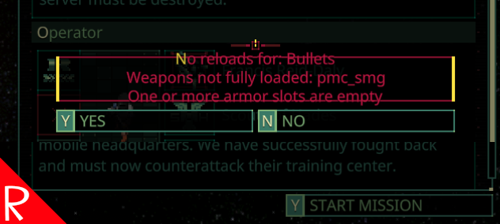

# Quasimorph Extra Deployment Checks

Just deployed on a mission to find that the merc wasn't reloaded from the previous mission's "unload all"? 

This mod includes optional loadout checks to the deployment window.

When deploying, the confirmation window will be shown if any of the optional checks below fail.

# Configuration

This mod supports MCM.  The config can be changed in the Mods menu or directly in the config file.

The configuration file will be created on the first game run and can be found at `%AppData%\..\LocalLow\Magnum Scriptum Ltd\Quasimorph_ModConfigs\QM_ExtraDeployChecks\config.json`.

|Name|Description|Config Key| Default|
|--|--|--|--|
|Empty Inventory|The game's default check.  Checks if the merc's inventory is completely empty.|CheckEmptyInventory|true|
|Empty Backpack|Checks if there are no items in the backpack|CheckEmptyBackpack|true|
|Extra Reloads|Checks if any weapon does not have a matching stack of ammo in inventory.|CheckExtraReloads|true|
|Partially Loaded Weapons|Checks if a weapon is not fully loaded.  Ex:  12 out of 24 rounds|CheckPartiallyLoadedWeapons|true|
|Armor Slot Empty|Checks if any armor slot is not filled.  Head, body, legs, feet|CheckArmorSlotNotFilled|true|
|Weapon Slot Empty|Checks if any weapon slot is not filled.  Head, body, legs, feet|CheckWeaponSlotNotFilled|true|

# Rough Edges
## UI Overdraw
The game's confirmation dialog does expand to the text size.
The warnings are still readable, just not pretty.

# Support
If you enjoy my mods and want to buy me a coffee, check out my [Ko-Fi](https://ko-fi.com/nbkredspy71915) page.
Thanks!

# Source Code
Source code is available on GitHub at https://github.com/NBKRedSpy/QM_ExtraDeployChecks

# Credits
* Special thanks to Crynano for his excellent Mod Configuration Menu. 

# Change Log

## 1.5.4
* Fix: Vest slots were not checked.
* Fix: Weapon based arm augments would give an empty weapon slot warning.
* Updated version detection for new "UNSTABLE BETA" format.
* Updated to support latest update.

## 1.5.3 
* 0.9.8.2 compatibility. 

## 1.5.2
* Fix for incorrect empty weapon slot check.

## 1.5.1
* Added check for empty weapon slot.

## 1.5.0 
* Added MCM.

## 1.4.0
* The names of items are now localized.  See note about missing ammo above.

